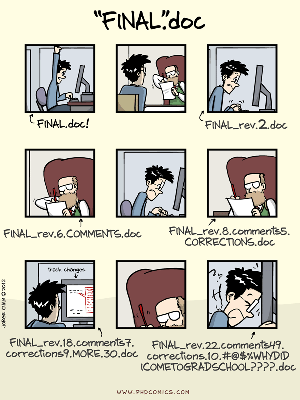
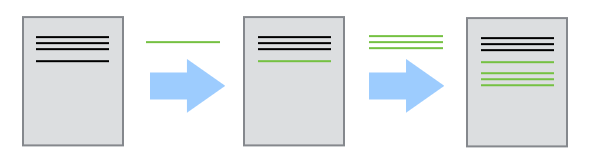
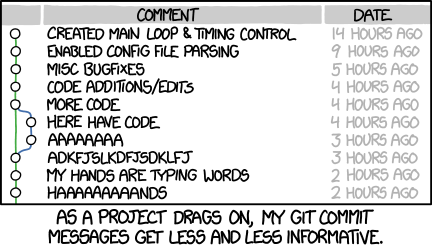
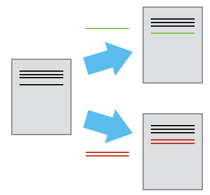
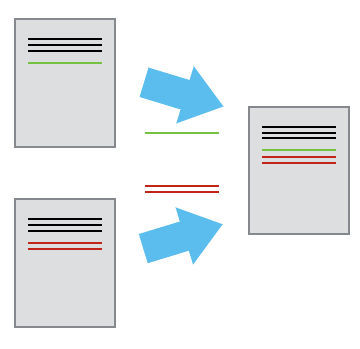
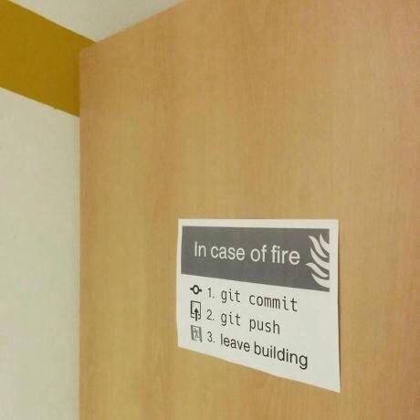

# Before we start {style="text-align: center;" .center}

## Any knowledge already?

* How many of you are already familiar with Git/GitHub and/or other so called "version control" systems?
* How many of you have already installed Git on your computer?

## Learning objetives

* Understand the basics of automated version control
* Understand the basics of `git` and `GitHub`
* Make use of `git` and `GitHub` with tools like `VS Code` and `R Studio`
* Be introduced on how to apply version control to your research

## A problem we all know

:::: {.columns}
::: {.column width="50%"}

[](https://phdcomics.com/comics/archive.php?comicid=1531){data-preview-link="true"}

PhD Comics "[FINAL.doc](https://phdcomics.com/comics/archive.php?comicid=1531){data-preview-link="true"}"

:::
::: {.column width="50%"}

#### Or from a code perspective...

```
my_analysis.R
my_analysis_FINAL.R
my_analysis_FINAL_v2.R
my_analysis_FINAL_v2_REVIEWED.R
my_analysis_FINAL_v2_REVIEWED_Jan.R
my_analysis_THIS_ONE.R
```

:::
:::

## The solution: version control

* We can record who made which changes, and when
* We can revert to previous versions
* We can identify and correct conflicts (e.g. possible overwriting)
* Nothing that is *committed* is *ever* lost (unless you try hard…)

**Version control is like an unlimited ‘undo/redo’.**

## How version control works {.smaller}

Version control is like a 'recording' of history



...Rewind and play changes back again!

## Now you might wonder...

What about: 

- `Microsoft Office 365`? 
- `Google Drive`? 
- `Dropbox`? 
- (etc. etc.)

**They do provide a "history of changes"!**

## Advantages

- **Intentional history** — every saved version has a message explaining why it changed, not just when
- **Real collaboration** — branching and merging let multiple people work in parallel without overwriting each other
- **Works on anything** — code, data, config files, and integrates with automation tools far beyond what a document editor supports

# Version control with Git and GitHub {style="text-align: center;" .center}

## What Is Git?

Git is a **version control system** — a tool that tracks changes to files over time.

- Takes "snapshots" of your project at key moments
- Lets you travel back to any previous state
- Records *who* changed *what* and *why*
- Enables safe collaboration with others

<br/>

::: {.callout-note appearance="minimal"}
Version control is like an **unlimited ‘undo/redo’**

Originally built for software — now essential for research.
:::

## Why Should Social Scientists Care? {.smaller}

<br />

| Challenge | Git Solution |
|-----------|-------------|
| "This chapter went sideways" | You can always track back when it deviated |
| "Which script produced this table?" | Every output is linked to exact code |
| "My collaborator broke something" | Revert to a working state instantly |
| "Reviewers want my analysis code" | Share a clean, documented history |
| "I deleted a crucial file" | Nothing is ever truly gone |


<br/>

::: {.callout-tip}
Git is a core infrastructure for [**reproducible research**](https://book.the-turing-way.org/){data-preview-link="true"}
:::

## What is GitHub {.smaller}

GitHub is a cloud-based platform that allows people to store, manage, and collaborate on "code" projects using `Git`

Core features:

- **Git Hosting**: It hosts Git repositories (projects), which allows developers to track changes to their code over time.
- **Collaboration**: Multiple developers can work on the same project simultaneously, creating "branches" to test new features without breaking the main, stable code.
- **Social Coding**: Users can share their public projects, follow others, and contribute to open-source software.

::: {.callout-tip}
Read more about GitHub in [GitHub doc](https://docs.github.com/en){data-preview-link="true"}
:::


## Git vs. GitHub

| | Git | GitHub |
|---|---|---|
| **What** | Local software | Cloud service |
| **Does** | Tracks changes locally | Hosts repos online |
| **Analogy** | Your wallet | Your bank |

<br/>

::: {.callout-note appearance="minimal"}
Other platforms: **GitLab**, **Bitbucket** — same Git, different banks.
:::

# Let's start with Git and GitHib {style="text-align: center;" .center}

(and create a Git repository)

## Prerequisites:

1. Download and install Git from the [Git website](https://git-scm.com/install/){data-preview-link="true"}
2. Create a GitHub account on [GitHub](https://github.com/signup){data-preview-link="true"}
3. Download and install [GitHub Desktop](https://github.com/signup){data-preview-link="true"}

## Steps to start

1. Configure Git [[Using GitHub Desktop](https://docs.github.com/en/desktop/configuring-and-customizing-github-desktop/configuring-git-for-github-desktop){data-preview-link="true"} or command line]
2. Create a folder (on your laptop)
3. Init a repository within the folder
4. Create/add your first file

## Starting a Project in GitHub Desktop

**Option A — New local project:**

1. `File` → `New Repository`
2. Give it a name, choose a folder, tick *Initialize with README*
3. Click **Create Repository**
4. Click **Publish repository** to push it to GitHub

**Option B — Clone an existing repo:**

1. `File` → `Clone Repository`
2. Browse your GitHub repos or paste a URL
3. Choose a local folder → **Clone**

> The repo now lives both on GitHub and on your computer.


## Core Concepts: The Three Areas

<br />

```
Working Directory  →  Staging Area  →  Repository
   (your files)       (selected         (permanent
                        changes)         history)
```

<br />

Think of it like writing a paper:

- **Working Directory** → your working draft
- **Staging Area** → pages you've selected to submit
- **Repository** → the final, archived version

## Your First Git Commands

Configure `git` from the command-line, here's how:

```bash
# Set up once on your machine
git config --global user.name "Ada Lovelace"
git config --global user.email "ada@research.ac"

# Start tracking a project
git init

# See what has changed
git status

# Stage a file
git add analysis.R

# Save a snapshot with a message
git commit -m "Add baseline regression model"
```

## The Commit: Heart of Git {.smaller}

A **commit** is a permanent snapshot of your project with:

- A unique ID (hash): `a3f92bc`
- Author name and email
- Timestamp
- A message you write
- The exact state of every tracked file

::: {.callout-tip}
Commits are your research diary — make them meaningful.

The complete history of **commits** and metadata is a **repository**
:::

## Good commit messages? {.nostretch}
What is likely to happen…

{width="50%"}

```
✅ "Recode income variable to quintiles for Table 3"
❌ "fixed stuff"
❌ "asdfgh"
```

## What to Track (and What Not to Track)

**✅ Track these:**
- R, Python, Stata scripts (`.R`, `.py`, `.do`)
- Quarto / RMarkdown files (`.qmd`, `.Rmd`)
- Small, raw data files (with permission)
- Documentation and codebooks

**❌ Do not track these (use `.gitignore`):**
- Large datasets (use OSF, Zenodo, or Dataverse)
- Sensitive / personally identifiable data
- Temporary files (`.Rhistory`, `__pycache__`)
- Output files that can be regenerated

## Ingnoring things

* Not all files are useful
  * Editor backup files
  * Temporary files
  * Intermediate analysis files

**.gitignore**

* `.gitignore` is a special file in your repository root
  * It tells `git` to ignore specified files/directories
  * It should be committed in your repository

## Git and Open Science

Git + GitHub enables powerful open science practices:

- **Persistent links** to exact code used in a paper
- **Tags and releases** to mark submission versions
- **Zenodo integration** — auto-DOI for every release
- **Pre-registration companion** — commit your analysis plan before data collection
- **Issue tracker** — structured feedback from reviewers or collaborators

::: {.callout-tip}
A public GitHub repo is increasingly expected at submission.
:::


## Multiple contributors (branching)

* Two people work on a document
  * Each makes independent changes: two versions



* Changes are separate from the document


## Combining changes (merging)

* Several changes can be merged onto the same base document
  * 'Merging'



## Seriously, `git push` when done…




## Key Takeaways

**Git gives your research a memory.**

1. **Commit often** — small, meaningful snapshots
2. **Write good messages** — future you will thank you
3. **Branch freely** — experiment without fear
4. **Push to GitHub** — backup, collaboration, transparency
5. **Use `.gitignore`** — keep sensitive data out

::: {.callout-tip}
**Git gives your research a memory.**
:::


## Essential resources
[*Happy Git and GitHub for the useR*](https://happygitwithr.com/) by Jenny Bryan — free online, written for researchers.


## Your feedback matters! 

{fig-align="center"}

Link: [https://forms.office.com/e/XMUhLD34Th](https://forms.office.com/e/XMUhLD34Th)


## Any question? {style="text-align: center;" .center background-image="/images/just_science_done_right.png" background-position="top right" background-repeat="no-repeat" background-size="15%"}

::: {style="text-align: center; margin-top: 1em"}
Simone Sacchi

Research Data Librarian, EUI Library

[simone.sacchi@eui.eu](mailto:simone.sacchi@eui.eu)

[resdata@eui.eu](mailto:resdata@eui.eu)

(Also Teams and BF-278)

[**EUI Library Research Data Guide**](https://eui.libguides.com/research-data-guide){data-preview-link="true"} - [**EUI Library Trainings**](https://www.eui.eu/events?u=lib){data-preview-link="true"}

{fig-align="center"}
:::

## End of the presentation {style="text-align: center;" .center}

## BACKUP SLIDES {style="text-align: center;" .center}